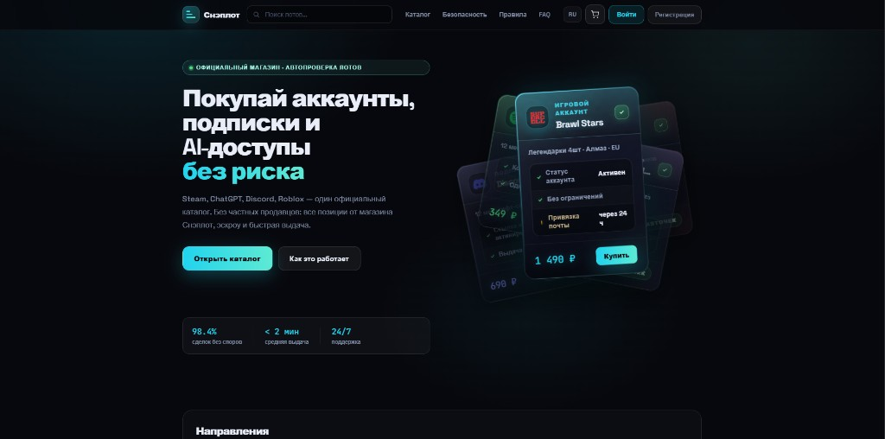
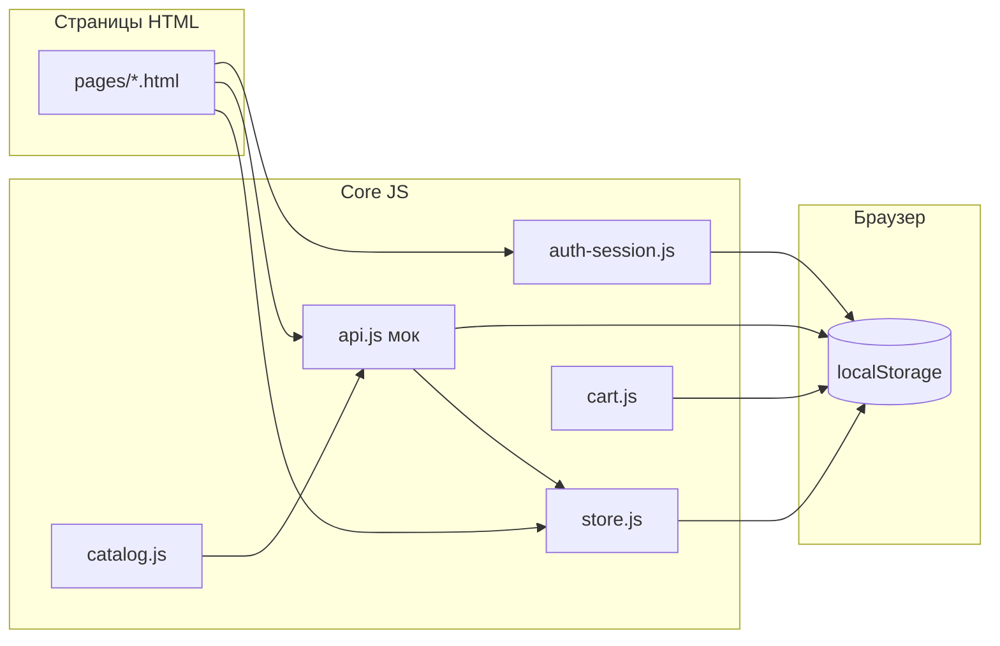

# Снэплот · Sneplot Store

**Чисто фронтенд-демо:** ни бэкенда, ни базы, ни настоящего HTTP API. Всё работает в браузере: статические HTML/CSS/JS, данные в `localStorage`, «запросы» обрабатывает один файл **`assets/js/core/api.js`** (внутренний маршрутизатор без сети).

[](https://shivarin.github.io/Sne-lot_Store/)
[](https://github.com/Shivarin/Sne-lot_Store)
[](LICENSE)
[](https://developer.mozilla.org/)

<p align="center">
  <a href="https://shivarin.github.io/Sne-lot_Store/" title="Открыть демо">
    
  </a>
</p>
<p align="center"><sub>Главная: тёмная тема, поиск, CTA в каталог, карточки лотов и блок доверия (эскроу, выдача, поддержка).</sub></p>

---

## Содержание

- [Живое демо](#живое-демо)
- [Макет структуры сайта](#макет-структуры-сайта)
- [О проекте](#о-проекте)
- [Возможности](#возможности)
- [Как открыть у себя](#как-открыть-у-себя)
- [Демо-доступы](#демо-доступы)
- [Сценарии для просмотра](#сценарии-для-просмотра)
- [Архитектура](#архитектура)
- [Слои данных и `localStorage`](#слои-данных-и-localstorage)
- [Мета-теги страниц](#мета-теги-страниц)
- [Структура каталогов](#структура-каталогов)
- [Ключевые модули](#ключевые-модули)
- [GitHub Pages](#github-pages)
- [Лицензия и автор](#лицензия-и-автор)

---

## Живое демо

**Откройте в браузере:** [https://shivarin.github.io/Sne-lot_Store/](https://shivarin.github.io/Sne-lot_Store/)

Это обычная раздача статики с GitHub Pages — **ничего устанавливать и не поднимать не нужно.**

---

## Макет структуры сайта

Простая схема экранов и потоков (wireframe, не UI-дизайн):

- **В браузере:** [docs/wireframe.html](https://shivarin.github.io/Sne-lot_Store/docs/wireframe.html)  
  (тот же путь локально: `docs/wireframe.html` после клонирования.)

Там блоки «витрина → лот → оформление», «аккаунт → админ» и группа инфо-страниц.

**Макет в Figma:** пошаговая инструкция (фреймы, цвета, блоки лендинга, экраны) — [docs/figma-wireframe-guide.md](docs/figma-wireframe-guide.md). Нарисовать файл в вашем аккаунте Figma из чата нельзя — только собрать по гайду или скопировать структуру с `wireframe.html` как подложку.

---

## О проекте

**Снэплот** — учебный/портфолио-проект: лендинг, каталог, лот, корзина, оформление, заказы, профиль, кошелёк, демо-выдача после «покупки», админка. В интерфейсе заложена модель **одного официального магазина** (не маркетплейс частных продавцов).

- Каталог и сценарии опираются на **сиды** и объект **`window.LISTINGS`**.
- Покупки, баланс, заказы, пользователи в демо — **только в этом браузере** (`localStorage`).
- Условные «методы API» (`/listings`, `/orders`, …) — **не REST-сервер**, а функция `handleDemo` в `api.js`: парсит путь и возвращает `Promise` с данными из памяти/сида. Наружу запросы **не уходят**.

---

## Возможности

| Область | Что есть |
|--------|-----------|
| Витрина | Каталог с фильтрами и сортировкой, страницы категорий, карточка лота |
| Покупка | Корзина, чекаут, списание баланса (демо), создание записи заказа |
| Выдача | Страница заказа с шагами и копированием полей (`order-delivery.js`) |
| Аккаунт | Локальная регистрация/вход, профиль, кабинет |
| Админ | Обзор, лоты/заказы в демо, форма нового товара (пишет в локальные данные) |
| UX | Избранное, сравнение, быстрый просмотр, Cmd+K, тёмная тема |
| PWA | `sw.js`, `offline.html` (заготовка) |

---

## Как открыть у себя

**Проще всего** — клонировать и смотреть то же, что на Pages:

```bash
git clone https://github.com/Shivarin/Sne-lot_Store.git
cd Sne-lot_Store
```

Дальше откройте **`index.html`** через **Live Server** в редакторе или любую команду вроде `npx serve` / `python -m http.server` — это **не сервер приложения**, а способ обойти ограничение браузера: при открытии файла как `file://` часть сценариев может не работать. Для демонстрации достаточно ссылки на GitHub Pages выше.

---

## Демо-доступы

| Роль | Email | Пароль |
|------|--------|--------|
| Администратор | `admin@demo.snaplot` | `demo` |

Учётка админа подставляется при загрузке (`demo-state.js` → `ensureDemoAdminAccount`).

Обычные пользователи — через `pages/register.html`, всё хранится локально (`snaplot:local-accounts`).

---

## Сценарии для просмотра

1. Главная → каталог → лот → корзина / оформление.
2. Кошелёк: пополнить баланс (демо), купить лот.
3. Заказ / выдача: `order.html`, `success.html` с параметром заказа.
4. Админ: `admin.html`, при необходимости `sell.html`.
5. Сброс: очистить данные сайта для origin или ключи `snaplot:*` в DevTools.

---

## Архитектура

### Без фреймворка и сборки

Статические файлы, **MPA**: у каждой страницы свой набор скриптов. Удобно отдавать с GitHub Pages и любого CDN.

### Слои кода

- **`assets/js/core/`** — мок «API», сессия, корзина, каталог, UI, шапка.
- **`assets/js/pages/`** — логика экрана (`market.js`, `lot.js`, …).
- **`assets/js/data/`** — сиды каталога.
- HTML в **`pages/`** и корневой **`index.html`**; пути **относительные** (`../assets/...`) — так корректно работает под префиксом `/Sne-lot_Store/` на Pages.

### «API» в этом репозитории

Во всех страницах проекта включён **только демо-режим** (`<meta name="snaplot-demo" content="1">`). Объект `window.API` вызывает `handleDemo`: это **имитация** ответов сервера, без реальных маршрутов и без обязательности что-то деплоить.

### Локальный вход

При `<meta name="snaplot-local-auth" content="1">` логин и регистрация идут через **`auth-session.js`**: пользователи в `localStorage`, условный токен `snaplot-local-v1`, сессия в `snaplot:local-session`. **`Store`** держит отображаемое состояние (`snaplot:store:v1`).

### События

`CustomEvent`: `snaplot:auth`, `snaplot:cart`, `snaplot:catalog-loaded`, `snaplot:balance` — связка модулей без отдельного брокера.

### Поток (упрощённо)



---

## Слои данных и `localStorage`

| Ключ | Назначение |
|------|------------|
| `snaplot:jwt` | Условный токен (в демо часто `snaplot-local-v1`) |
| `snaplot:local-accounts` | Локальные пользователи |
| `snaplot:local-session` | Текущая сессия для мока |
| `snaplot:store:v1` | Баланс, избранное, отображаемый пользователь |
| `snaplot:demo-orders` | Заказы |
| `snaplot:demo-sold-listings` | Пометки «продано» |
| `snaplot:demo-extra-listings` | Лоты, добавленные в админке |
| `snaplot:demo-listing-status` | Статусы лотов |

---

## Мета-теги страниц

| Мета | В проекте | Зачем |
|------|-----------|--------|
| `snaplot-demo` | `1` | Включён мок `api.js` |
| `snaplot-local-auth` | `1` | Локальные регистрация и вход |

Отдельный «боевой» API в этом репозитории **не подключается** и в документации не описывается.

---

## Структура каталогов

```
├── index.html              # Лендинг
├── docs/                   # Скрин README + wireframe структуры (wireframe.html)
├── pages/                  # Экраны сайта
├── assets/
│   ├── css/
│   ├── js/
│   │   ├── core/           # мок API, auth, store, cart, …
│   │   ├── pages/
│   │   └── data/           # сиды LISTINGS
│   ├── data/
│   └── icons/
├── deploy/                 # старые примеры конфигов (для демо не нужны)
├── favicon.svg
├── sw.js
├── offline.html
├── robots.txt, sitemap.xml
├── STRUCTURE.txt
└── README.md
```

---

## Ключевые модули

| Файл | Роль |
|------|------|
| `api.js` | Демо-маршрутизация путей; ответы из памяти/сида, без сети |
| `auth-session.js` | Локальный вход, токен, `refreshUser` |
| `store.js` | Клиентское состояние, избранное, баланс |
| `demo-state.js` | Доп. лоты админа, учётка демо-админа |
| `demo-market.js` | Вспомогательная логика заказов в демо |
| `order-delivery.js` | Поля выдачи по заказу |
| `catalog.js` | Наполнение `LISTINGS` через тот же мок |
| `nav-shell.js` | Корзина в шапке |
| `header.js` | Навбар |

---

## GitHub Pages

В репозитории: **Settings → Pages →** ветка **`main`**, папка **`/`**. Сайт: **https://shivarin.github.io/Sne-lot_Store/**

Не используйте в ссылках ведущий `/` вроде `href="/pages/..."` — сайт лежит в подкаталоге, нужны относительные пути.

---

## Лицензия и автор

- **[MIT](LICENSE)**
- Открытая демо-витрина; при форке поменяйте брендинг и тексты под себя.

**Репозиторий:** [github.com/Shivarin/Sne-lot_Store](https://github.com/Shivarin/Sne-lot_Store)
