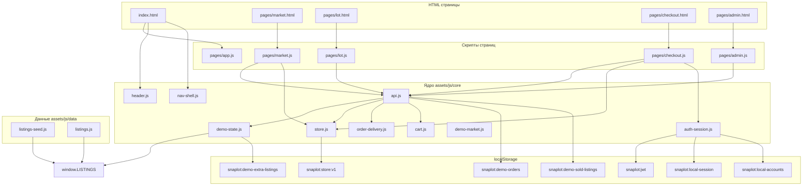

# Снэплот · Sne-lot Store

**Статический фронтенд-демо:** без бэкенда в репозитории, без базы данных и без обязательного HTTP API. В браузере работают HTML/CSS/JS, данные живут в **`localStorage`**, условные запросы обрабатывает **`assets/js/core/api.js`** (внутренний маршрутизатор `handleDemo` без сети, пока на странице включён демо-режим).

[](https://shivarin.github.io/Sne-lot_Store/)
[](https://github.com/Shivarin/Sne-lot_Store)
[](LICENSE)
[](https://developer.mozilla.org/)

---

## Содержание

- [Живое демо](#живое-демо)
- [Зависимости и требования](#зависимости-и-требования)
- [О проекте](#о-проекте)
- [Как запустить локально](#как-запустить-локально)
- [Полный поток работы приложения](#полный-поток-работы-приложения)
- [Структура репозитория](#структура-репозитория)
- [Типичный порядок подключения скриптов](#типичный-порядок-подключения-скриптов)
- [Мок API (`api.js`)](#мок-api-apijs)
- [События `CustomEvent`](#события-customevent)
- [Ключи `localStorage`](#ключи-localstorage)
- [Мета-теги страниц](#мета-теги-страниц)
- [Ключевые модули](#ключевые-модули)
- [Демо-доступы](#демо-доступы)
- [Сценарии для проверки](#сценарии-для-проверки)
- [GitHub Pages](#github-pages)
- [Лицензия](#лицензия)

---

## Живое демо

**Сайт на GitHub Pages:** [https://shivarin.github.io/Sne-lot_Store/](https://shivarin.github.io/Sne-lot_Store/)

Для просмотра достаточно браузера: сервер приложения не поднимается, репозиторий — это статика.

---

## Зависимости и требования

| Категория | Что нужно |
|-----------|-----------|
| **Node / npm / сборка** | **Не используются.** В репозитории нет `package.json`, нет Webpack/Vite — только готовые файлы. |
| **Браузер** | Современный движок с поддержкой ES5/ES2015+ (IIFE, `Promise`, `localStorage`, `fetch` используется только в ветке «реального» API при `meta api-base`; в демо доминирует синхронная логика + `Promise` в `api.js`). |
| **Сеть** | Страницы подключают **Google Fonts** (`fonts.googleapis.com`, `fonts.gstatic.com`). Без сети шрифты могут не подгрузиться, логика сайта от этого не ломается. |
| **Способ открытия** | Рекомендуется **HTTP** (`localhost` или GitHub Pages), а не `file://`: так корректнее работают путей к ресурсам, сервис-воркер и привычная модель origin для `localStorage`. |
| **Бэкенд** | Не входит в проект. При `meta name="api-base"` с непустым значением `api.js` может ходить на реальный сервер через `fetch`; в текущих страницах демо включён `snaplot-demo`, сеть для «каталога» не нужна. |

Итого: **зависимости для разработки отсутствуют**, достаточно клонировать репозиторий и открыть сайт через любой статический сервер или Pages.

---

## О проекте

**Снэплот** — демо-витрина одного официального магазина цифровых товаров: лендинг, каталог, карточка лота, корзина, оформление, заказы, кабинет, кошелёк, выдача по заказу, админка.

- Каталог строится из **`window.LISTINGS`**, который наполняется из **`assets/js/data/`** (сиды) и при необходимости дополняется демо-слоем (`DemoState`).
- Покупки, баланс, заказы и пользователи в демо существуют **только в этом браузере** (`localStorage`).
- Вызовы вида `API.get("/listings")` в режиме демо **не уходят в интернет** — их обрабатывает `handleDemo` в `api.js`.

---

## Как запустить локально

```bash
git clone https://github.com/Shivarin/Sne-lot_Store.git
cd Sne-lot_Store
```

Поднять любой статический сервер из корня репозитория, например:

```bash
npx --yes serve -p 3000
```

или

```bash
python -m http.server 3000
```

Откройте в браузере `http://localhost:3000/` (или указанный порт). Главная: `index.html`.

---

## Полный поток работы приложения

Ниже — связка **что видит пользователь**, **какой код участвует** и **где хранятся данные**.

### 1. Первая загрузка любой страницы

1. Браузер загружает HTML и CSS.
2. Если подключены **`listings-seed.js`** / **`listings.js`**, в памяти появляется объект **`window.LISTINGS`** (каталог для карточек и API-представления).
3. **`store.js`** читает снимок состояния из `localStorage` (`snaplot:store:v1`): баланс для UI, избранное, имя пользователя и т.д.
4. **`auth-session.js`** проверяет **`snaplot:jwt`**. В локальном режиме допустим псевдо-токен `snaplot-local-v1`, профиль читается из **`snaplot:local-session`**.
5. **`api.js`** при демо после загрузки вызывает **`DemoState.ensureDemoAdminAccount()`** — в **`snaplot:local-accounts`** добавляется учётная запись администратора, если её ещё не было.
6. **`nav-shell.js`** (через `snaplotPaintNavChrome`) подмешивает в шапку корзину/гостевые кнопки там, где разметка «хрома» неполная, синхронизирует бейдж корзины.
7. **`header.js`** вешает обработчики: мобильное меню (`nav--open` + `nav-drawer-open`), дропы уведомлений и профиля, поиск по Enter → маркет.

### 2. Витрина: каталог и категории

1. Пользователь открывает **`pages/market.html`** или **`pages/category.html`**.
2. Страничный скрипт (**`market.js`** и т.п.) вызывает **`API.get("listings?...")`**.
3. В демо **`api.js`** собирает список через **`buildItems()`**: учитываются сиды, **`DemoState.injectExtraIntoListings()`**, статусы и «продано» из **`snaplot:demo-sold-listings`**.
4. Результат рендерится в сетку; избранное синхронизируется с **`Store`** и при необходимости с **`API`** (мок эндпоинтов `favorites`).

### 3. Карточка лота

1. Переход на **`pages/lot.html?id=...`**.
2. **`lot.js`** запрашивает **`API.get("listings/<id>")`** — тот же объект **`LISTINGS`**, нормализованный под поля API.
3. Корзина (**`cart.js`**) добавляет позицию локально; бейдж обновляется событием **`snaplot:cart`**.

### 4. Корзина и оформление

1. Иконка корзины открывает выезжающую панель (**`nav-shell.js`** → **`ensureDrawer`**, **`SnaplotCartDrawer`**), список строк строится из **`Cart.items()`**.
2. На **`checkout.html`** логика страницы проверяет авторизацию и баланс, оформление идёт через **`API.post("orders", { listing_id })`** (в демо это **`purchaseViaApi`** внутри `api.js`).

### 5. Покупка (ядро демо-экономики)

Выполняется в **`purchaseViaApi`** (`api.js`), если пользователь в сессии и хватает средств на **`Store`**:

1. С баланса списываются рубли (**`Store.setBalance`**), начисляются бонусные баллы (если реализовано в Store).
2. В **`snaplot:demo-orders`** дописывается заказ; в **`snaplot:demo-sold-listings`** помечается лот как проданный.
3. **`OrderDelivery.attachToOrder`** добавляет к заказу поля для экрана выдачи (ключи, инструкции и т.д. — см. **`order-delivery.js`**).
4. Локальная сессия и кошелёк синхронизируются (**`Auth.persistLocalWalletFromStore`** при наличии).
5. Позиция убирается из корзины; диспатчатся **`snaplot:balance`** и **`snaplot:cart`**.

### 6. Заказы и выдача

1. Список заказов: **`API.get("orders")`** — фильтрация по `buyer_id` / `seller_id` из текущей локальной сессии.
2. Страница заказа подключает **`order-delivery.js`** для отображения и копирования выдачи.

### 7. Админка

1. Вход под **`admin@demo.snaplot`** (роль `admin` в локальных аккаунтах).
2. **`API.post("listings", …)`** добавляет лот в **`snaplot:demo-extra-listings`** и в **`LISTINGS`** через **`DemoState.appendApiListing`**.
3. **`API.patch("listings/<id>", { status })`** меняет статус в **`snaplot:demo-listing-status`**.

### Диаграмма потоков данных (упрощённо, но целиком по слоям)



---

## Структура репозитория

| Путь | Назначение |
|------|------------|
| **`index.html`** | Лендинг магазина |
| **`pages/*.html`** | Внутренние экраны (каталог, лот, кабинет, …) |
| **`assets/css/`** | Стили: `vars`, `base`, `components`, страничные |
| **`assets/js/core/`** | Общая логика: API, сессия, корзина, шапка, PWA |
| **`assets/js/pages/`** | Логика конкретных экранов |
| **`assets/js/data/`** | Сиды каталога (`listings.js`, `listings-seed.js`) |
| **`sw.js`**, **`offline.html`** | Заготовка офлайн / PWA |
| **`deploy/`** | Примеры nginx и systemd **для собственной раздачи статики**, не обязательны для демо |

---

## Типичный порядок подключения скриптов

На большинстве страниц соблюдается цепочка (порядок важен из-за глобалов `window.*`):

1. **`app.js`** или страничный bundle (если есть) — лёгкая инициализация UI.
2. **`listings.js`** (+ при необходимости **`listings-seed.js`**) — каталог.
3. **`store.js`** — состояние.
4. **`cart.js`** — корзина.
5. **`demo-state.js`**, **`demo-market.js`** — демо-данные и вспомогательные проверки.
6. **`api.js`** — `window.API`, при старте подмешивает админа.
7. **`auth-session.js`** — вход/выход в локальном режиме.
8. **`ui.js`**, **`nav-shell.js`**, **`header.js`** — интерфейс и шапка.
9. Страничный скрипт: **`market.js`**, **`lot.js`**, **`checkout.js`**, …

Точный список тегов `<script>` смотрите внизу соответствующего HTML-файла.

---

## Мок API (`api.js`)

Все пути ниже — строка первого аргумента `API.get` / `API.post` / `API.patch` / `API.delete` **без** базового URL. В демо **`handleDemo`** разбирает `method` и `path`.

| Метод и путь | Назначение |
|--------------|------------|
| `GET users/me` | Текущий пользователь из `snaplot:local-session` и токена |
| `GET users/me/bonuses` | Баллы из `Store` |
| `POST users/me/wallet/deposit` | Пополнение баланса (демо), синхронизация сессии |
| `GET favorites` | Список id избранного |
| `POST favorites/<listing_id>` | Добавить в избранное |
| `DELETE favorites/<listing_id>` | Убрать из избранного |
| `GET orders` | Заказы текущего пользователя из `snaplot:demo-orders` |
| `POST orders` с `{ listing_id }` | Покупка: списание, заказ, sold, выдача |
| `GET listings` | Каталог (query: `platform`, `limit`) |
| `GET listings/<id>` | Один лот |
| `POST listings` | Создание лота (**только admin**) → `snaplot:demo-extra-listings` |
| `PATCH listings/<id>` | Смена статуса (**admin**) → `snaplot:demo-listing-status` |
| `GET admin/overview` | Сводка для админки |
| `GET admin/listings` | Список лотов включая скрытые |
| `GET admin/orders` | Все заказы |
| `POST auth/forgot-password` | Заглушка «письмо отправлено» |
| `POST auth/reset-password` | Заглушка сброса |
| `POST auth/login`, `register`, `verify-email` | В демо возвращают ошибку с текстом «используйте локальный режим» или заглушку |

Если на странице **нет** `meta name="snaplot-demo" content="1"` и задан **`meta name="api-base"`**, те же методы `API.*` уходят на реальный сервер через **`fetch`** (ветка `realFetch`) — в текущем репозитории страницы заточены под демо.

---

## События `CustomEvent`

| Событие | Когда полезно |
|---------|----------------|
| **`snaplot:auth`** | Смена сессии пользователя |
| **`snaplot:cart`** | Изменилась корзина |
| **`snaplot:balance`** | Изменился баланс |
| **`snaplot:catalog-loaded`** | Обновился каталог (например, после добавления лота из админки) |

Подписчики: шапка, бейджи, страницы с суммами.

---

## Ключи `localStorage`

| Ключ | Назначение |
|------|------------|
| `snaplot:jwt` | Маркер «вошёл»; в локальном демо часто значение `snaplot-local-v1` |
| `snaplot:local-accounts` | Реестр локальных пользователей (email, пароль, роль) |
| `snaplot:local-session` | Текущий профиль для мока API |
| `snaplot:store:v1` | Баланс, избранное, отображаемый пользователь, бонусы |
| `snaplot:demo-orders` | Массив заказов |
| `snaplot:demo-sold-listings` | Объект «какой лот продан» |
| `snaplot:demo-extra-listings` | Лоты, созданные из админки (формат API) |
| `snaplot:demo-listing-status` | Статусы лотов (`active` / `removed` / …) |
| `snaplot:cart:v1` | Позиции корзины (массив id, количество, цены) |

Полный сброс демо: очистить данные сайта для origin или вручную удалить ключи с префиксом **`snaplot:`**.

---

## Мета-теги страниц

| Мета | Значение в проекте | Смысл |
|------|-------------------|--------|
| `snaplot-demo` | `1` | Включён мок `handleDemo` в `api.js` |
| `snaplot-local-auth` | `1` | Регистрация и вход через `auth-session.js` |
| `api-base` | Обычно отсутствует | Если задан непустой URL — запросы уйдут на сервер (не используется в демо-страницах репозитория) |

---

## Ключевые модули

| Файл | Роль |
|------|------|
| `api.js` | Демо-маршрутизация, покупка, админ-обзор, избранное |
| `auth-session.js` | Локальный вход, токен, `refreshUser` |
| `store.js` | Клиентское состояние вне заказов |
| `cart.js` | Корзина в `localStorage` |
| `demo-state.js` | Доп. лоты, статусы, учётка демо-админа |
| `demo-market.js` | Вспомогательная логика маркет/заказы |
| `order-delivery.js` | Поля выдачи для заказа |
| `catalog.js` | Загрузка/слияние каталога там, где подключён |
| `nav-shell.js` | Корзина в шапке и мобильные пункты |
| `header.js` | Бургер, дропы, поиск |
| `mobnav.js` | Нижняя панель на внутренних страницах (не на корневом `index.html`) |
| `home-fan.js` | Карусель примеров на лендинге (узкая ширина) |

---

## Демо-доступы

| Роль | Email | Пароль |
|------|--------|--------|
| Администратор | `admin@demo.snaplot` | `demo` |

Обычные пользователи создаются через **`pages/register.html`**.

---

## Сценарии для проверки

1. Главная → каталог → карточка лота → корзина → оформление (при достаточном балансе).
2. Кошелёк: пополнение (демо) → покупка → заказ в списке.
3. Страница заказа / выдача: `order.html`, `success.html` с параметрами.
4. Админка: создание лота, смена статуса.
5. Сброс: удалить ключи `snaplot:*` в DevTools.

---

## GitHub Pages

**Settings → Pages:** ветка **`main`**, папка **`/`** (корень).

Публичный URL вида **`https://<user>.github.io/<repo>/`**. Все пути в HTML **относительные** (`pages/...`, `assets/...`), без ведущего `/`, чтобы работало из подкаталога репозитория.

Примеры конфигов для своего сервера — в **`deploy/`** (не обязательны для GitHub Pages).

---

## Лицензия

Проект распространяется по лицензии **[MIT](LICENSE)**. При форке замените брендинг и юридические тексты под свой продукт.

**Репозиторий:** [github.com/Shivarin/Sne-lot_Store](https://github.com/Shivarin/Sne-lot_Store)
