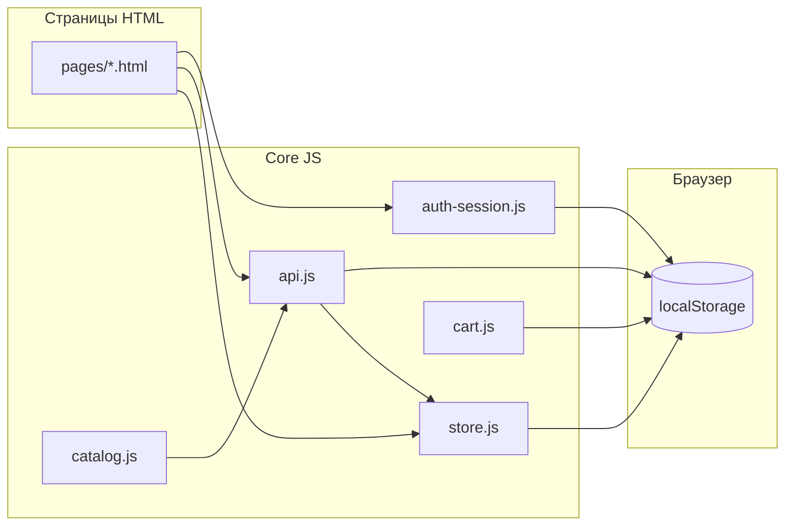

# Снэплот · Sne-lot Store

Демо-витрина цифровых товаров без бэкенда: статический фронтенд, «API» и персистентность в браузере.

[](https://shivarin.github.io/Sne-lot_Store/)
[](https://github.com/Shivarin/Sne-lot_Store)
[](LICENSE)
[](https://developer.mozilla.org/)

---

## Содержание

- [Живое демо](#живое-демо)
- [О проекте](#о-проекте)
- [Возможности](#возможности)
- [Быстрый старт (локально)](#быстрый-старт-локально)
- [Демо-доступы](#демо-доступы)
- [Сценарии для просмотра](#сценарии-для-просмотра)
- [Архитектура и решения](#архитектура-и-решения)
- [Слои данных и `localStorage`](#слои-данных-и-localstorage)
- [Мета-теги страниц](#мета-теги-страниц)
- [Структура каталогов](#структура-каталогов)
- [Ключевые модули](#ключевые-модули)
- [Расширение под реальный API](#расширение-под-реальный-api)
- [GitHub Pages](#github-pages)
- [Лицензия и автор](#лицензия-и-автор)

---

## Живое демо

**Сайт на GitHub Pages:** [https://shivarin.github.io/Sne-lot_Store/](https://shivarin.github.io/Sne-lot_Store/)

Убедитесь, что в настройках репозитория включён **Pages** (ветка `main`, папка `/`). Первая сборка может занять 1–3 минуты.

---

## О проекте

**Снэплот** — учебный/портфолио-проект: лендинг, каталог, карточка товара, корзина, оформление заказа, заказы, профиль, кошелёк, демо-выдача после покупки, админка. Модель бизнеса в интерфейсе: **один официальный магазин** (не маркетплейс частных продавцов).

Сервер приложения **не требуется** для демо: данные каталога подмешиваются из сидов, заказы и кошелёк пишутся в `localStorage`, HTTP-запросы к бэкенду **имитируются** в `assets/js/core/api.js`.

---

## Возможности

| Область | Что есть |
|--------|-----------|
| Витрина | Каталог с фильтрами и сортировкой, страницы категорий, карточка лота |
| Покупка | Корзина (`nav-shell`), чекаут, списание баланса, создание заказа |
| Выдача | Страница заказа с шагами проверки и копированием полей (`order-delivery.js`) |
| Аккаунт | Регистрация/вход в локальном режиме, профиль, кабинет |
| Админ | Обзор, список лотов/заказов, создание лота (`sell` + API POST в демо) |
| UX | Избранное, сравнение, быстрый просмотр, Cmd+K, тёмная тема |
| PWA | `sw.js`, `offline.html` (базовая заготовка) |

---

## Быстрый старт (локально)

```bash
git clone https://github.com/Shivarin/Sne-lot_Store.git
cd Sne-lot_Store
```

Поднимите **статический HTTP-сервер** из корня (без него `file://` часто ломает загрузку скриптов и JSON):

```bash
npx --yes serve .
```

или

```bash
python -m http.server 8080
```

Откройте URL, который вывел сервер (например `http://localhost:3000`).

---

## Демо-доступы

| Роль | Email | Пароль |
|------|--------|--------|
| Администратор | `admin@demo.snaplot` | `demo` |

Учётная запись админа **создаётся/нормализуется** при загрузке любой страницы с демо-API (`demo-state.js` → `ensureDemoAdminAccount`).

Обычные пользователи регистрируются через `pages/register.html`; пароли и профили хранятся **только в этом браузере** (`snaplot:local-accounts`).

---

## Сценарии для просмотра

1. **Главная** → переход в каталог → открыть лот → «В корзину» / оформление.
2. **Кошелёк**: пополнить баланс (демо), затем купить лот с достаточной суммой.
3. **Заказ**: после покупки открыть выдачу (`order.html`, `success.html` с параметром заказа).
4. **Админ**: войти под админом → `pages/admin.html` / добавление товара через `pages/sell.html`.
5. **Сброс демо**: очистить данные сайта в настройках браузера для домена (или удалить ключи `snaplot:*` в DevTools → Application).

---

## Архитектура и решения

### Почему без фреймворка и сборщика

- Проект должен **открываться с GitHub Pages и любого статического хостинга** без Node на стороне хостинга.
- Проще сопровождать как **набор HTML-страниц (MPA)**: у каждой страницы свой набор скриптов, без единого SPA-бандла.

### Разделение «ядро / страницы / данные»

- **`assets/js/core/`** — переиспользуемая логика: мок API, сессия, корзина, каталог, UI, шапка.
- **`assets/js/pages/`** — инициализация конкретного экрана (`market.js`, `lot.js`, `checkout.js`, …).
- **`assets/js/data/`** — сиды каталога (`listings-seed.js`, загрузчик `listings.js`).
- HTML лежит в **`pages/`** (кроме корневого `index.html`); пути к ресурсам **относительные** (`../assets/...`) — это важно для GitHub Pages (`/Sne-lot_Store/`).

### Два режима API (один и тот же фасад `window.API`)

| Режим | Как включается | Поведение |
|--------|----------------|------------|
| **Демо** | По умолчанию; явно: `<meta name="snaplot-demo" content="1">` | Запросы не уходят в сеть; ответы из `handleDemo` в `api.js` |
| **Реальный бэкенд** | `<meta name="api-base" content="https://your-host">` | `GET/POST/...` на `{api-base}/api/v1/...` через `fetch` |

Так страницы не переписываются при смене бэкенда: меняется только мета и наличие сервера.

### Локальная аутентификация

- При `<meta name="snaplot-local-auth" content="1">` (и в демо) вход/регистрация идут через **`auth-session.js`**: список пользователей в `localStorage`, фиктивный JWT `snaplot-local-v1`, сессия в `snaplot:local-session`.
- `Store.applyApiUser` синхронизирует отображаемое имя, баланс и роль в **`snaplot:store:v1`**.

### Каталог и заказы в демо

- Витрина строится из **`window.LISTINGS`** (объект `id → карточка`), наполняется из сидов и `GET /listings` в демо.
- Заказы пишутся в **`snaplot:demo-orders`**; «проданные» лоты помечаются в **`snaplot:demo-sold-listings`**.
- Админские POST/PATCH лотов добавляют записи через **`DemoState`** (`snaplot:demo-extra-listings`, статусы в `snaplot:demo-listing-status`).

### События между модулями

Используются простые **`CustomEvent`** (например `snaplot:auth`, `snaplot:cart`, `snaplot:catalog-loaded`, `snaplot:balance`), чтобы не тянуть общий event-bus файлом.

### Поток данных (упрощённо)



---

## Слои данных и `localStorage`

Основные ключи (не исчерпывающе, но достаточно для отладки):

| Ключ | Назначение |
|------|------------|
| `snaplot:jwt` | Текущий токен (в демо часто `snaplot-local-v1`) |
| `snaplot:local-accounts` | Массив локальных пользователей и паролей (демо) |
| `snaplot:local-session` | Текущий «профиль» сессии для мок API |
| `snaplot:store:v1` | Клиентское состояние: баланс, избранное, пользователь, … |
| `snaplot:demo-orders` | Массив заказов в демо |
| `snaplot:demo-sold-listings` | Карта проданных лотов |
| `snaplot:demo-extra-listings` | Лоты, добавленные админом в демо |
| `snaplot:demo-listing-status` | Статусы лотов (active / removed / …) |

---

## Мета-теги страниц

На демо-страницах обычно задано:

| Мета | Значение | Смысл |
|------|----------|--------|
| `snaplot-demo` | `1` | Включить мок `API` |
| `snaplot-local-auth` | `1` | Локальные регистрация/вход |
| `api-base` | URL | Если задан — демо отключается, идут реальные запросы |

---

## Структура каталогов

```
├── index.html              # Лендинг
├── index2.html             # Редирект/совместимость
├── pages/                  # Все основные экраны
├── assets/
│   ├── css/                # Тема: vars, base, components + страницы
│   ├── js/
│   │   ├── core/           # api, auth-session, store, cart, catalog, ui, …
│   │   ├── pages/          # Скрипты по страницам
│   │   └── data/           # Сиды LISTINGS
│   ├── data/               # listings.json и др.
│   └── icons/
├── deploy/                 # Примеры nginx/systemd (под будущий сервер API)
├── favicon.svg
├── sw.js                   # Service Worker
├── offline.html
├── robots.txt, sitemap.xml
├── STRUCTURE.txt           # Краткая карта (дополнение к README)
└── README.md
```

Корневой **`styles.css`** — наследие/совместимость; основной UI в **`assets/css/`**.

---

## Ключевые модули

| Файл | Роль |
|------|------|
| `api.js` | Режим демо/прод; маршрутизация путей `/listings`, `/orders`, `/users/me`, админка |
| `auth-session.js` | Токен, локальный логин, `refreshUser`, событие `snaplot:auth` |
| `store.js` | Состояние клиента, избранное, баланс, подписка UI на изменения |
| `demo-state.js` | Доп. лоты админа, статусы, учётка `admin@demo.snaplot` |
| `demo-market.js` | Вспомогательная логика заказов/продаж в демо |
| `order-delivery.js` | Данные выдачи (учётные поля) и привязка к заказу |
| `catalog.js` | Подгрузка каталога в `LISTINGS` через API |
| `nav-shell.js` | Корзина в шапке, гость/авторизованный |
| `header.js` | Уведомления, баланс в навбаре |

---

## Расширение под реальный API

1. Убрать или не ставить `snaplot-demo`, задать **`api-base`** на origin с префиксом `/api/v1`.
2. Реализовать на сервере контракты, которые уже вызывает фронт (см. ветки `handleDemo` в `api.js` и вызовы `API.get/post/...` в страницах).
3. Локальный режим отключится сам: `Auth` будет ходить в `/auth/login` и т.д.

Папка **`deploy/`** — ориентир для nginx/systemd под отдельный API-сервер, не обязательна для статического демо.

---

## GitHub Pages

1. **Settings → Pages**
2. Source: **Deploy from a branch**
3. Branch: **`main`**, folder: **`/(root)`**
4. Публичный URL: **https://shivarin.github.io/Sne-lot_Store/**

Не используйте в разметке ссылки вида `href="/pages/..."` с ведущим `/` — на Pages сайт лежит в подкаталоге, нужны **относительные** пути.

---

## Лицензия и автор

- Лицензия: **[MIT](LICENSE)**.
- Проект **Sne-lot Store** / Снэплот — открытая демо-витрина; при форке обновите брендинг, тексты и учётные данные под свой кейс.

**Репозиторий:** [github.com/Shivarin/Sne-lot_Store](https://github.com/Shivarin/Sne-lot_Store)
